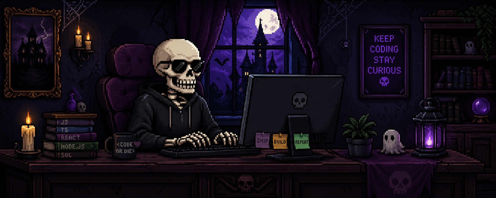

  

<h1 align="center">Hi there, I'm <a href="https://github.com/BaileyKH">Bailey</a></h1>

  <strong>Software Engineer | Tech Goblin | Horror Fanatic</strong>

  I enjoy building software that balances thoughtful design with solid engineering. Most of my experience has been in the React and TypeScript ecosystem, but over time I've become increasingly interested in backend development, application architecture, authentication, databases, and the systems that make great user experiences possible.

  I love learning new technologies, building projects from the ground up, and understanding how everything fits together, from responsive interfaces to APIs and infrastructure. Whether I'm experimenting with a new idea, contributing to production applications, or diving into a side project, my goal is always the same: build software that's clean, reliable, and enjoyable to use.

---

### About Me
- I’m currently working on modern web applications using React, Next.js, and Tailwind CSS.  
- I’m always learning and exploring new technologies, currently diving deeper into **Node** and **Express**.  
- When I'm not coding, you'll probably find me exploring new technologies, refining existing projects, or tackling the next problem that catches my curiosity.

---

### Languages and Tools

|  |  |  |  |  |  |
| --- | --- | --- | --- | --- | --- |
|  |  |  |  |  |  |

---

### BootDev Stats (always stay learning)

  

---

### Connect with Me

  
  

